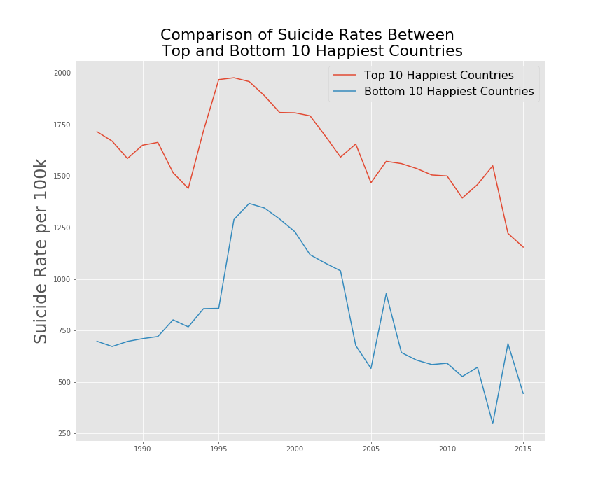
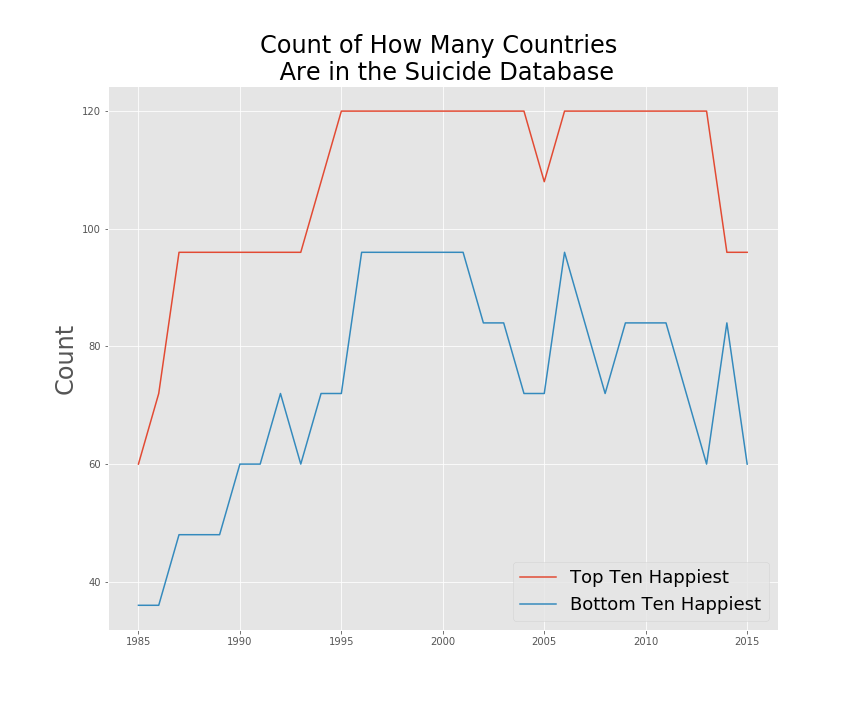
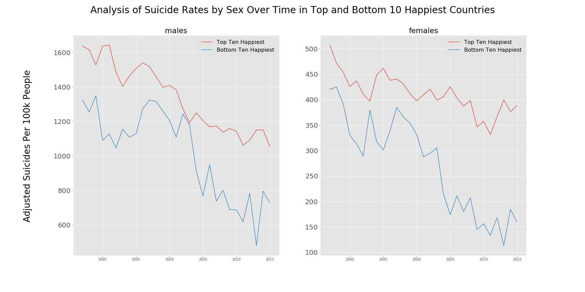

# Analysis of Suicide Rates in 'Happy' and 'Less Happy' Countries

## Do Countries with Higher Happiness Rankings in the World Happiness Report have Lower Suicide Rates than the Countries with the Lowest Happiness Rankings?

What does the overall "happiness" of a country really tell us about life in that country? In 2012, the first World Happiness Report was published with a formal presentation in front of the United Nations in 2017. The report ranks 155 countries by their happiness level, and serves as an import public policy tool which helps politicians, economists, pychologists, health officials, and others critically think about how their policies affect civilian life.

But, how does a society with more sophisticated infrastructure, less corrupt politics, less war, and more money affect the suicide rate?

I was inclined to believe that happier countries would experience less suicide than unhappy countries simply because the standard of life was better. However, I began to wonder if happier countries experience a whole set of other complex societal factors that may otherwise affect the suicide rate. 

I decided to compare suicide rates in the last 30 years between countries that rank the highest in the World Happiness Report to the lowest ranked countries to find out.

(For simplistic sake, I will refer to the top 10 ranked countries as "happy" countries and countries in the bottom 10 as "unhappy" countries. I am not making a judgment call on life in any of the discussed countries.)

## Data
The World Happiness Report contains data between 2015 and 2019, while the Suicde Database contains data from 1986-2016. I averaged the happiness scores in the 5 .csv files and then compared that to countries that were actually represented in the suicide database. At this point, I was able to pull the top and bottom 10 happy countries to start drawing comparisons. I assumed that countries that ranked highly in happiness between 2015-2019 were also generally happy from 1986-2016 and same for the bottom happiness countries. It's fair to say that this is a big leap, but I believe that the scores vary widely enough between them to support my assumption.

Here are the top and bottom 10 happiest countries averaged:

| Top 10 Country | Happiness Score | 
| ----------- | ----------- |
| Denmark | 7.54283 |
| Norway | 7.53783 |
| Switzerland | 7.524 |
| Iceland | 7.51933 |
| Finlands | 7.51583 |
| Netherlands | 7.40017 |
| Canada | 7.36333 |
| Sweden | 7.32667 |
| New Zealand | 7.3085 | 
| Australia | 7.2775 |

| Bottom 10 Country | Happiness Score | 
| ----------- | ----------- |
| Bosnia and Herzegovina | 5.12633 |
| Greece | 5.10317 |
| Mongolia | 5.00333 |
| Albania | 4.75367 |
| South Africa | 4.66967 |
| Bulgaria | 4.55183 |
| Armenia | 4.386 |
| Sri Lanka | 4.37233 |
| Ukraine | 4.3695 | 
| Georgia | 4.33183 |

## Exploratory Data Analysis
After cleaning my data using pandas, my first goal was to immediately gain insight into the overall suicide trends between the happy and unhappy nations. I used the top and bottom 10 countries in my averaged happiness ranking to pull my desired data from the suicides database. I grouped the data by year so I was able to plot the changes overtime.

I immediately noticed that the happier countries consistently had higher suicide rates/100k people than the unhappy countries. I began to wonder and suspect that the happier countries may appear to have higher suicide rates because they have more representation in the database. It was imperitive for me to check the count of each country in the database.

In an ideal scenario, the database should provide us with 120 data points per year. 10 countries * 2 sexes * 6 age groups. However, only the happy countries have all 120 data points in less than half of the years. I decided that the above graph was not a fair representation of the story and I devised an inflation constant that I would apply to both happy and unhappy countries to adjust their suicides1. Even though this makes the following graphs imperfect, I believe that it generally tells the story more accurately.

After adjusting my data, I felt confident that my analysis will now be more faithful to the truth.  While still not 100% accurate, it is far better than the way I was reporting the information previously. With the adjustment, it's clear that happier countries still report higher suicide rates than unhappy countries overall. On a positive note, suicide rates have been decreasing over time.

## Deeper Dive
Even though I seemed to have answered my primary question, I thought it would be useful to look at how suicide rates compare between sexes and also age groups. Perhaps there was one category where the opposite would be true.

Suicide rates are still higher in happier countries even when split among geder. Interestingly, male suicide rates are significantly higher than female suicide rates as well. It's worth considering that men and women face different cultural and societal pressures than women that may lead to higher suicide rates. Again, the rates seem to be decreasing overall fortunately for both men and women.

Suicide rates by age grou pare also pretty clearly split between happy and less happy countries, except in the 75+ category (5-14 year olds appear to look very volatile because the suicide rates are very low overall). Interestingly, suicides in the eldest age group are some of the highest and are not clearly split between happy and less happy nations. Mental health and well-being of the elderly population should be especially considered when making public health decisions.

## What's Next?
At this point, I felt confident to draw the conclusion that happier countries in general experience a higher suicide rate than unhappy countries. The next logical question is: Why? This million dollar question is an entire subject of its own, but I decided to try to examine that question with the data at hand.

Since the happiness report is comprised of a sum of other various metrics, I thought it would be worthwhile seeing if there were any standouts in these categories. I was looking to see if unhappy nations weighted a certain category higher than the happier countries, which would provide some insight into what may help reduce suicide rates.

However, the happier countries still scored higher in every metric than the bottom happier countries. The broader societal reasons that may attribute to higher suicide rates may be out of the scope of this dataset.

## Conclusion
In conclusion, I have determined that there appears to be an inverse relationship between happier countries and less happy countries. This is the opposite of what I believed at the start of my analysis. Additionally, happier countries also have hgiher rates when compared accross sexes and age groups. It's important to note that men and the elderly experience higher suicide rates as well. And while the Happiness World Report lacks insight into the reasons why suicide may be occuring, the conclusions drawn from this analysis may still prove to be useful to official charged with public policy and mental health.

# References
[Suicide Rates Overview Kaggle Database](https://www.kaggle.com/russellyates88/suicide-rates-overview-1985-to-2016)

[World Happiness Report Kaggle Database](https://www.kaggle.com/unsdsn/world-happiness#2019.csv)

1Inflation Factors Used (I divided 120 by the count in that year):

| Year | Top 10 Inflation Factor | Bottom 10 Inflation Factor |
| ----------- | ----------- | -----|
| 1985 | 2.00 | 3.33 |
| 1986 | 1.67 | 3.33 |
| 1987 | 1.25 | 2.50 |
| 1988 | 1.25 | 2.50 |
| 1989 | 1.25 | 2.50 |
| 1990 | 1.25 | 2.00 |
| 1991 | 1.25 | 2.00 |
| 1992 | 1.25 | 1.67 |
| 1993 | 1.25 | 2.00 |
| 1994 | 1.11 | 1.67 |
| 1995 | 1.00 | 1.67 |
| 1996 | 1.25 | 1.25 |
| 1997 | 1.00 | 1.25 |
| 1998 | 1.00 | 1.25 |
| 1999 | 1.00 | 1.25 |
| 2000 | 1.00 | 1.25 |
| 2001 | 1.00 | 1.25 |
| 2002 | 1.00 | 1.43 |
| 2003 | 1.00 | 1.43 |
| 2004 | 1.00 | 1.67 |
| 2005 | 1.11 | 1.67 |
| 2006 | 1.00 | 1.25 |
| 2007 | 1.00 | 1.43 |
| 2008 | 1.00 | 1.67 |
| 2009 | 1.00 | 1.43 |
| 2010 | 1.00 | 1.43 |
| 2011 | 1.00 | 1.43 |
| 2012 | 1.00 | 1.67 |
| 2013 | 1.00 | 2.00 |
| 2014 | 1.25 | 1.43 |
| 2015 | 1.25 | 2.00 |